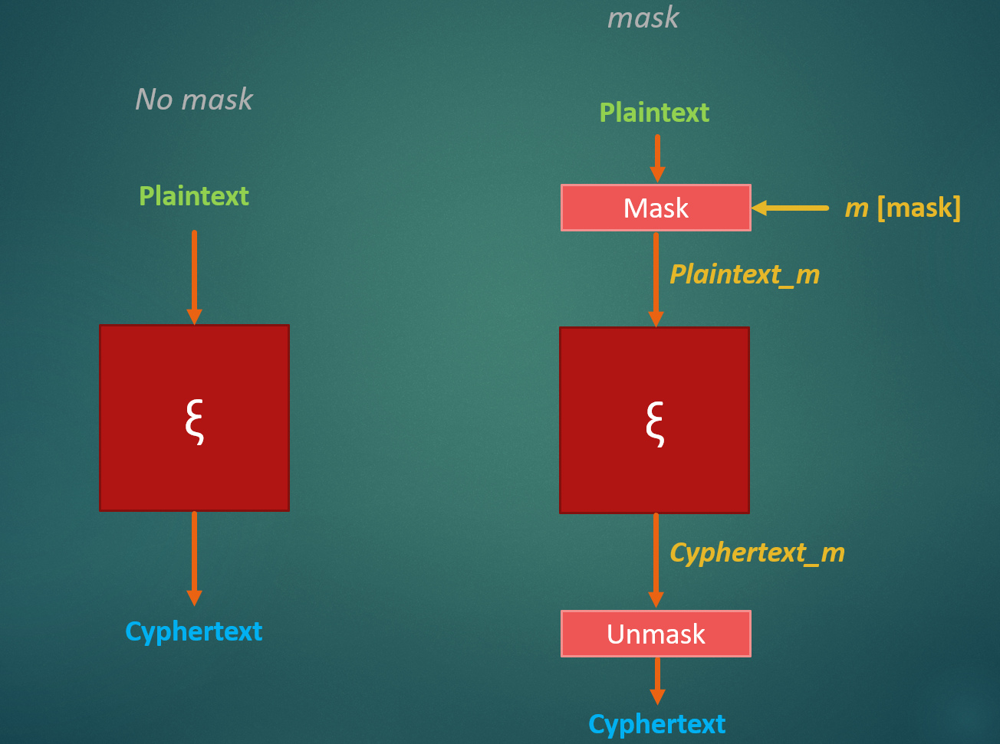

# Affine masking of the lightweight encryption algorithm Skinny-128-384+

End-of-studies project about the affine masking of **Skinny-128-384+** (a lightweight encryption algorithm with 128-bits of plaintext, 384-bit key and 40 rounds). More precisely, Skinny is the Tweakable Block Cipher of Romulus, one of the 10 finalists of the [NIST Lightweight Cryptography competition](https://csrc.nist.gov/Projects/lightweight-cryptography/finalists) in 2023. You can learn more about the implementation details of Romulus and Skinny in the [Romulus final spec](https://csrc.nist.gov/CSRC/media/Projects/lightweight-cryptography/documents/finalist-round/updated-spec-doc/romulus-spec-final.pdf).

The goal of this project was to protect Skinny against [Side-Channel Attacks](https://en.wikipedia.org/wiki/Side-channel_attack) (SCA), attacks which aim to exfiltrate sensitive information, including cryptographic keys, by measuring coincidental hardware emissions.

## The masking, a countermeasure against SCA

To protect against any possible leakage, I first "masked" my datas before encrypting it.



<br> In the above diagram, we can see that, through masking, the encryption algorithm operates solely with masked values. Consequently, if attackers successfully conduct a Side-Channel Attack and obtain sensitive datas, they won't be able to manipulate it while it remains masked.

### Affine masking

Every  secret byte $x \in GF(256)$ is manipulated in the form:<br><br>
$G(x) = r_1 \cdot x \oplus r_0$<br><br>
where:
* $G(x)$ is the affine mask of $x$
* $r_1 \in GF(256)$ is the multiplicative mask
* $r_0 \in GF(256)$ is the additive mask
* $\cdot$ is the multiplication in the $Galois\ Field\ of\ Order\ 256$

$r_0$ and $r_1$ are randomly chosen for each encryption.

## STM32L475 as the target board

That's important to execute our encryption functions on a target board in order to simulate the SCA attacks and check out if our countermeasure is really efficient.<br>
I choosed the STM32L475 as the target board (the embedded processor is an Arm Cortex-M4). More info on this board in the [reference manuel](https://www.st.com/resource/en/reference_manual/rm0351-stm32l47xxx-stm32l48xxx-stm32l49xxx-and-stm32l4axxx-advanced-armbased-32bit-mcus-stmicroelectronics.pdf).

## Repo organisation

This directory implements a firmware from scratch that programs our STM32L475 board. It reads a plaintext in rolling broadcasts,encrypts it using either the protected version of Skinny or its reference version, and renders the resulting cyphertext.<br>
It is also possible to run python scripts that save processor traces in dedicated files and display them using the matplotlib library.
<br><br>
Below are explanations of the most important files of the repo:

* `cmsis/` and `Drivers/` contain the necessary files to set up the board correctly (clocks, trigger, uart, cache, etc)<br>

* `Implementation/affine_mask/` contains the protected version of the Skinny algorithm while `Implementation/ref/` contains its reference version. For a same plaintext, both algorithms return the same ciphertext.<br>

* `control_send.py` uses the uart connection between the computer and the board to send plaintext for encryption and a key for use. The file also saves the traces captured by the oscilloscope.<br>

* `firmware.c` contains the `main` function. It reads the plaintext and the key from the uart and processes the encryption by using either the reference version of Skinny or its protected version.<br>

* `Makefile` to compile and flash the target easily.<br>

* `mask_aff_decalage.ipynb` notebook which demonstrates that $G(k \ll n) \neq G(k) \ll n$ <br>

* `print_traces.py` is a python script which displays the processor traces during the encryption using the matplotlib library.

## Using the firmware

First compile the code.
```shell
$ make build
```

 Then establish a connection between your PC and the target board (we will use JLink and GDB Server).
 ```shell
$ make startgdbserver
```

Once you are in GDB, flash the board :
 ```shell
flash
```

Open an other terminal and send plaintext to be encrypted to the board :
 ```shell
$ ./control_send.py
```

When you have the processor traces, you can display them with :
 ```shell
$ ./print_traces.py
```

See if there are any differences between the protected version and the reference version of the algorithm. For the more daring, try to find the value of the key or the plaintext!
